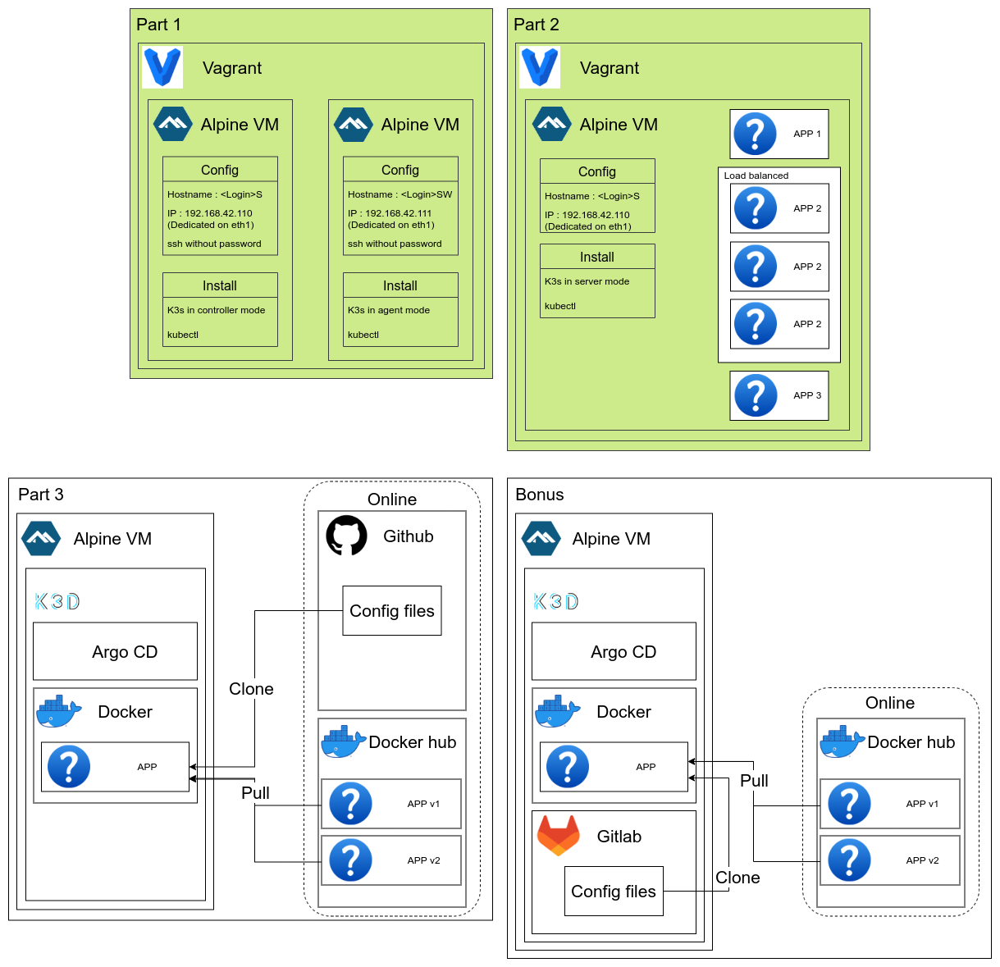

# INCEPTION OF THINGS

## Presentation

This is a project from 42 school, its goal was to let us learn the basics of cloud infrastructure through:

- VM (Vagrant)
- Kubernetes (K3s)
- Continuous deployment (ArgoCD)

But we chose to go way further than the mandatory part of the subject by doing the suggested bonus:

- Setting up a Gitlab instance on K3s as the source of IaC

As well as our own bonuses:

- Implementing https and http to https redirection (p2)
- Building docker image from Dockerfile locally (p2)
- Building our own continuous integration
- Publishing our own images to local Gitlab registry for usage in ArgoCD

Leading us to a full in house cloud solution.

## Architecture

## Usage

This project was created to run on a Debian VM. It should work on any Debian/Ubuntu installation though.

First, you need to install the dependencies. Every part was designed to run independently so the only thing to do is run the install_dependencies.sh script before launching each part.

The first two parts can be run by executing `vagrant up` in the appropriate folder.

Don't hesitate to run `vagrant destroy -f && vagrant up` if you already ran that part once.

The third and bonus parts, which do not use Vagrant, can be run using the `init.sh` script in the scripts folder.